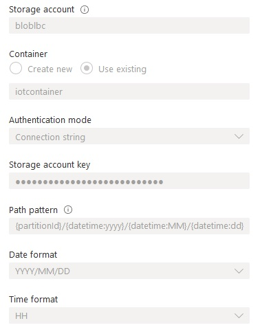

## Iot Pipeline with Azure Stream Analytics and DataBricks

### Summary
This project implement an Iot pipeline from end to end. The streaming data is generated by a raspberry pi web simulator. The realtime data is fed to an Azure Iot hub. An Azure stream analytics job is set up to pre-process the raw data save the data in Azure blob storage. 
After mid-night every day, an DataBricks job is triggered to incrementally read the data from blob storage, transformed and appended to Azure Data Lake in parquet format. An time-series forcast job can be carried out at the same time.

### ETL Process
The Azure portal can be setup following the Microsoft turtorial below except the Stream Analytics job.
https://docs.microsoft.com/en-us/azure/stream-analytics/stream-analytics-quick-create-portal
For the Azure Stream Analytics job, the input setup is the same. The output path is set up as `{partitionId}/{datetime:yyyy}/{datetime:MM}/{datetime:dd}` so that data from different device each day are stream into different folders as below:

The query process the data in a small time window in real-time to filter out excessive data in order to reduce data size.

The rest of the job can be just finised by the `iot_pipeline.ipynb` file in Databricks.
